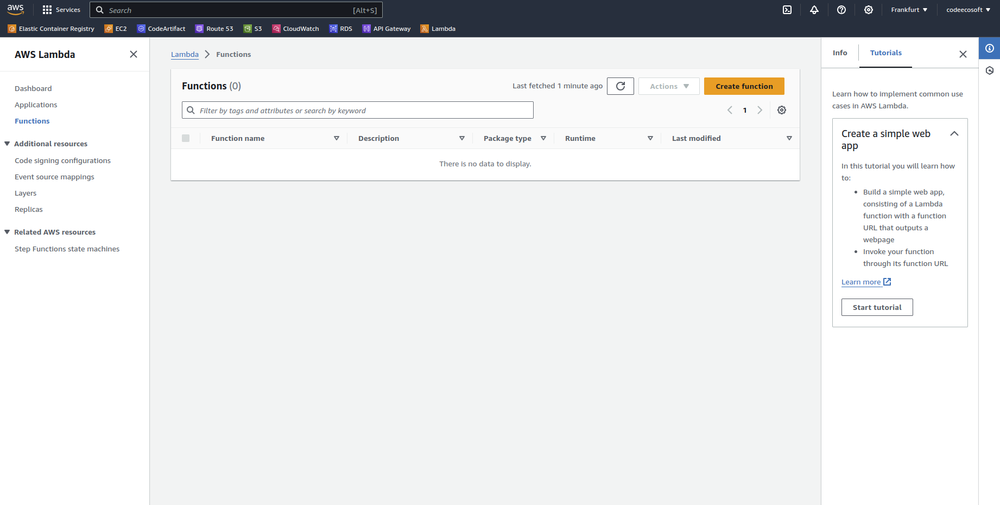
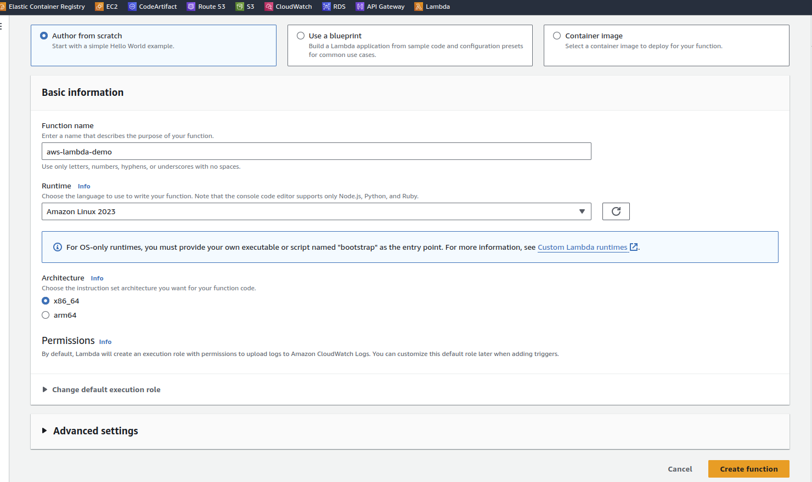
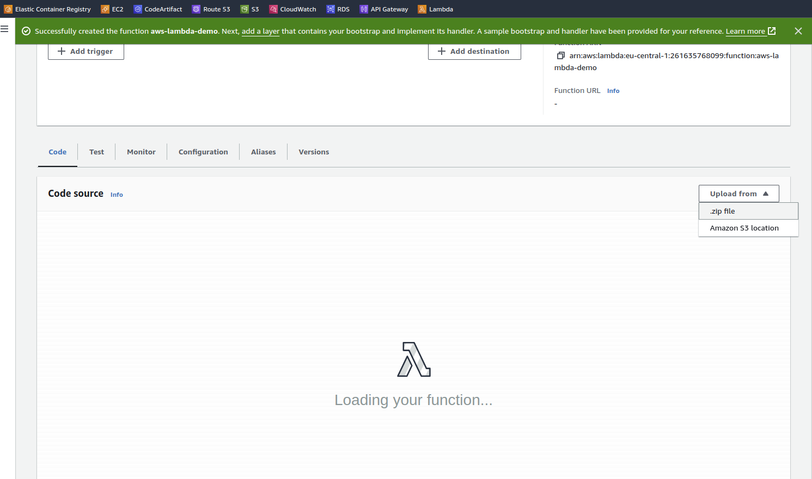
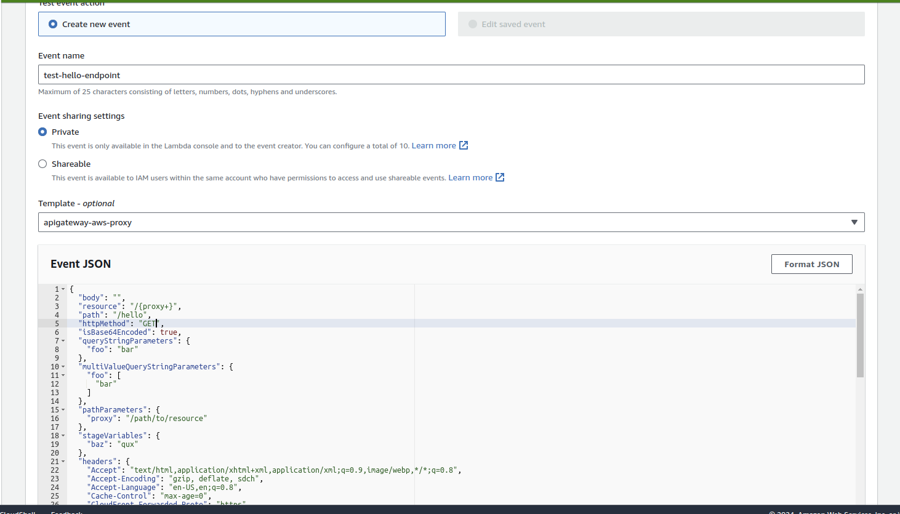
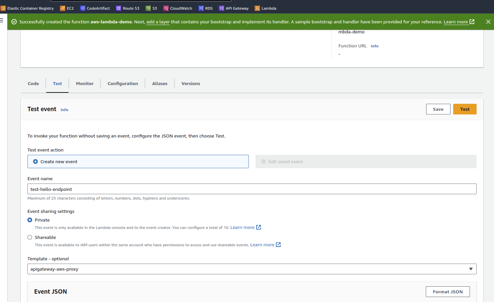
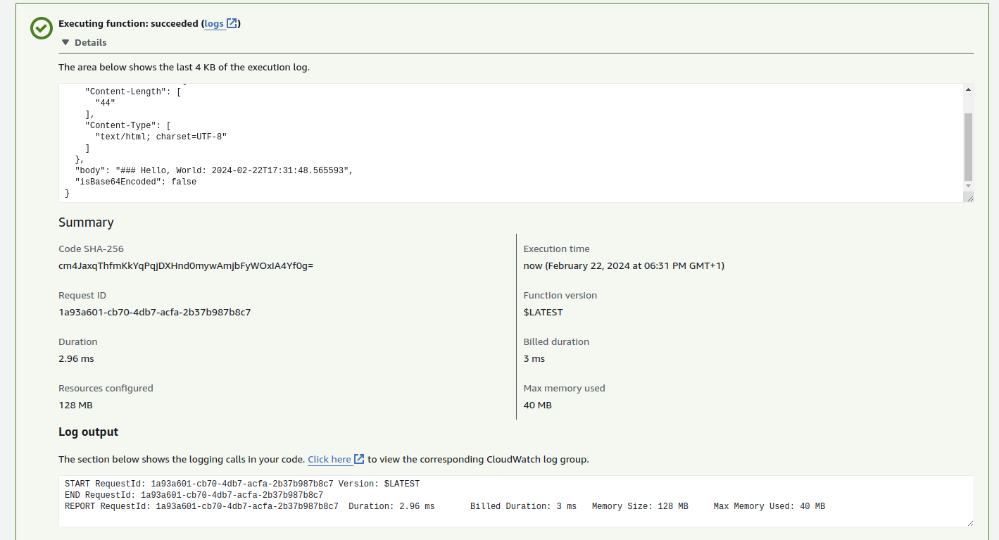

# AWS Lambda Demo #

# Prerequisite
- installed and set up GraalVM (v21)

# Steps (manual)
1) Build
```
mvn -X -Pnative -DskipTests clean native:compile
```
2) Create final ZIP (bootstap + native executable)

```
cp boostrap target/
cd target
zip app.zip bootstrap lambda-demo
```

Login into AWS account
Search for `lambda`, open it, Then click `Create function`


Give the function some name
and for the runtime choose: Amazon Linux 2023


Then click on `code` tab and upload previously created `app.zip` from the target


Then click on `test` populate some `Event name` and choose for `Template` -> apigateway-aws-proxy


Because this endpoint is HTTP "GET"
set body to "", path to your path ("/hello"), and httpMethod: GET


Then click `Save` and then `Test`
We will see the output


## Using Serverless framework ##
If using serverless framework:
# Prerequisite
- installed [serverless framework](https://www.serverless.com/)
- installed [AWS CLI](https://aws.amazon.com/cli/)
- authorize via AWS CLI


Steps:
1) Deploy
```
sls deploy
```

2) Remove
```
sls remove
```