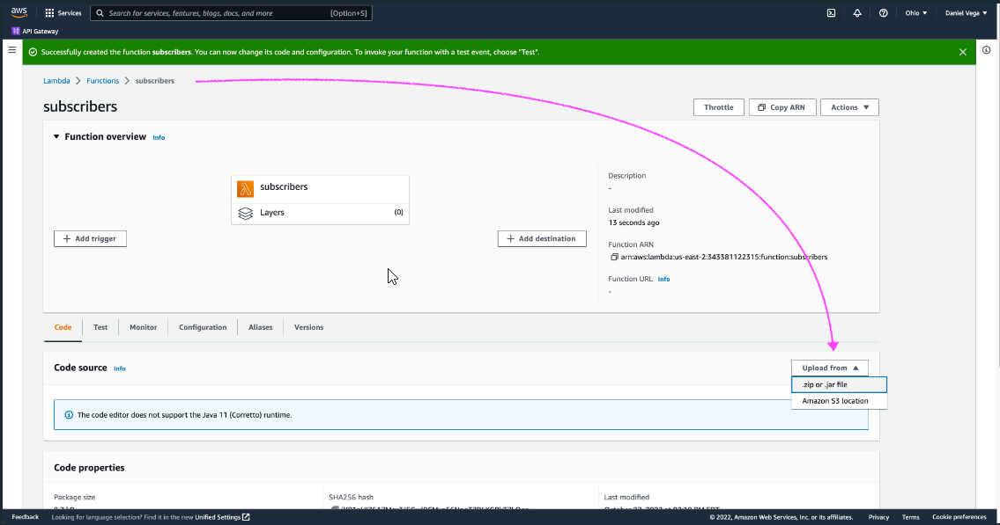
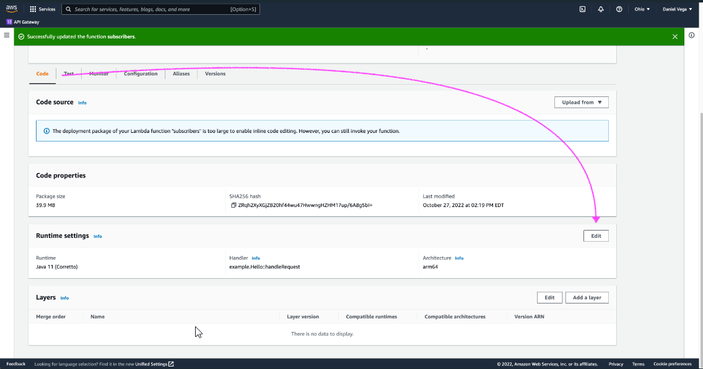
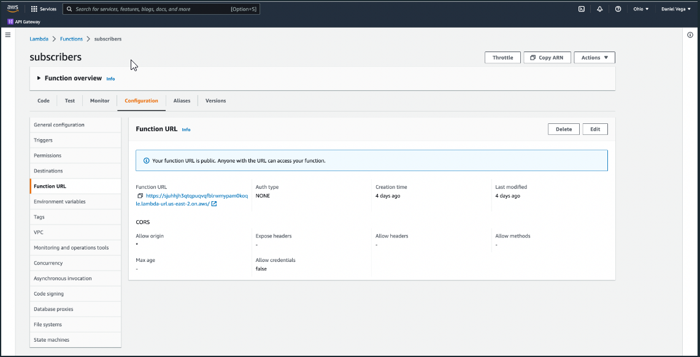
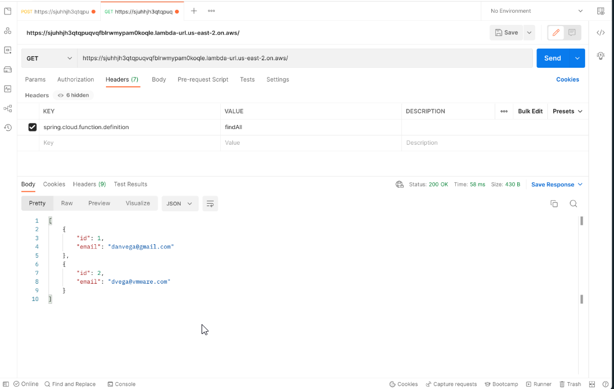

# Spring Cloud Function Serverless Application

This repository contains a simple serverless application built using Spring Cloud Function, which enables the development of serverless functions with Spring Framework.

## Tutorial Resources

You can follow along with the tutorial videos provided:

- [YouTube Tutorial](https://www.youtube.com/watch?v=gj1DDymw5iY&ab_channel=DanVega)
- [VMware Tanzu Guide](https://tanzu.vmware.com/developer/guides/serverless-spring/)

## Setup Instructions

To set up the project and run the serverless application, follow these steps:

1. **Create lambda function and upload jar file:**
   

2. **Add Spring Cloud Function Dependency**: Ensure that you have the necessary dependencies for Spring Cloud Function in your `pom.xml` file. You can find detailed instructions in the tutorial resources provided above.

3. **Configure Runtime Settings**: Edit the runtime settings as per the instructions provided in the tutorial. Specify `org.springframework.cloud.function.adapter.aws.FunctionInvoker::handleRequest` as the handler, which is a generic request handler.

4. **Generate Function URL**: Once you have configured your function, you can generate the function URL which will be used to access your endpoint.
   

## Usage

After setting up the application, you can use Postman or any other HTTP client to interact with your serverless function. Follow these steps:

1. **Set Function Definition**: In the request header, add `spring.cloud.function.definition` as the key, and specify the method name as the value. This maps the function to the endpoint.

2. **Send Requests**: Send HTTP requests to the generated function URL, passing any required parameters or payloads based on the functionality of your serverless function.

